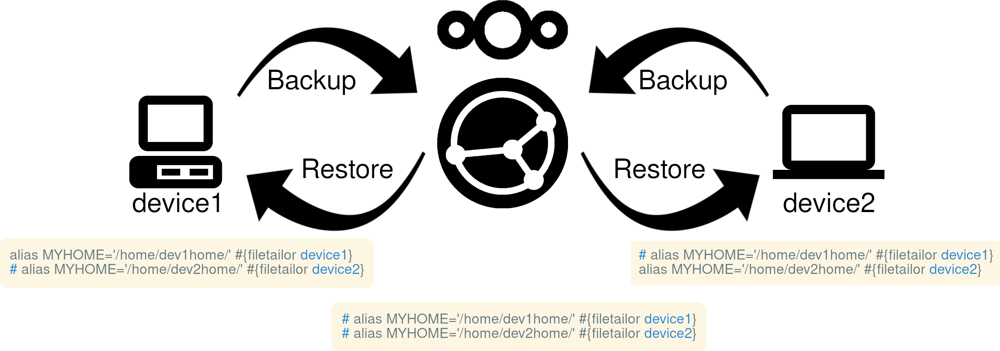

# filetailor

filetailor is a peer-based configuration management utility for plain-text files (and directories) such as dotfiles. Files are backed up to a specified folder using filetailor, transferred to another device using tools such as [Nextcloud](https://nextcloud.com/), [Syncthing](https://syncthing.net/), or [Git](https://git-scm.com/), and then restored on other devices using filetailor again.

During the backup and restore process, filetailor can modify the file contents and path for the specific device according to variables and line-specific controls defined in YAML. See [list of features](https://github.com/k4j8/filetailor/wiki/Features).



<!-- START doctoc generated TOC please keep comment here to allow auto update -->
<!-- DON'T EDIT THIS SECTION, INSTEAD RE-RUN doctoc TO UPDATE -->
**Table of Contents**  *generated with [DocToc](https://github.com/thlorenz/doctoc)*

- [Example Usage](#example-usage)
- [Getting Started](#getting-started)
  - [Installation](#installation)
  - [Configuration](#configuration)
  - [Usage](#usage)
- [Line-Specific Control](#line-specific-control)
    - [Example: single-line control](#example-single-line-control)
- [Diff Tool](#diff-tool)
- [More Help](#more-help)
- [Contributing](#contributing)

<!-- END doctoc generated TOC please keep comment here to allow auto update -->

## Example Usage

Here's how to sync a file to use `dev1home` on `device1` and `dev2home` on `device2`.

**.bashrc** on `device1`:

```bash
alias MYHOME='/home/dev1home/' #{filetailor device1}
# alias MYHOME='/home/dev2home/' #{filetailor device2}
```
```bash
[user@device1 ~]$ filetailor add .bashrc
[user@device1 ~]$ filetailor backup
```

Sync the files using your preferred method of choice to `device2` then restore. Lines with tags for other devices get automatically commented out.
```bash
[user@device2 ~]$ filetailor restore
```

**.bashrc** on `device2:`

```bash
# alias MYHOME='/home/dev1home/' #{filetailor device1}
alias MYHOME='/home/dev2home/' #{filetailor device2}
```

## Getting Started

### Installation

filetailor requires Python 3.6+ and pip. Install by running the following commands:
```bash
$ pip install filetailor

$ filetailor init
# Update the newly created "filetailor.ini" with your desired locations for synced files and configuration YAML

$ filetailor init
# Accept confirmations to create directories
```

See [Alternative Installs](https://github.com/k4j8/filetailor/wiki/Alternative-Installs) for other installation methods.

### Configuration

`filetailor.yaml` ("the YAML") controls which files sync to which devices.

You can add/remove files to/from the YAML by running `filetailor add PATHS` and `filetailor remove PATHS` (local paths are okay). Alternatively, you can update the YAML manually by following the comments within.

The YAML also defines variables, which are strings to replace when restoring to a specific device, such as a path to a file that differs between devices. See the [FAQ](https://github.com/k4j8/filetailor/wiki/FAQ) in the wiki for examples.

### Usage

To backup all files defined in the YAML from the local device to the sync folder, run `filetailor backup`.

To restore all files defined in the YAML from the sync folder to the local device, run `filetailor restore`.

To list all available commands, run `filetailor --help` or `filetailor COMMAND --help` for command details.

## Line-Specific Control

You can control the contents of individual files by device with line-specific controls such as the [Example Usage](https://github.com/k4j8/filetailor#example-usage) above. There are two types of line-specific controls: single-line and multi-line.

To use a single-line control, append a tag to the line you want to be commented out on other devices. The line will be commented out on all devices *except* those listed within the tag. Single-line control tag format:
<pre><code class="text">(Code being controlled) <i>COMMENT_SYM</i><b>{filetailor</b> <i>DEVICES</i>...<b>}</b></code></pre>
`COMMENT_SYM` is any symbol(s) used for comments and must be preceded by at least one space.

To control a block of lines, see [Multi-line Controls](https://github.com/k4j8/filetailor/wiki/Multi-Line-Controls).

#### Example: single-line control

How the code should be written on `desktop1`:
```bash
export $device_type="desktop" #{filetailor desktop}
# export $device_type="laptop" #{filetailor laptop1 laptop2}
```

After backing up the file through filetailor and then restoring to `laptop1` or `laptop2`, the code would appear like this:
```bash
# export $device_type="desktop" #{filetailor desktop}
export $device_type="laptop" #{filetailor laptop1 laptop2}
```

How the code would look on any other device and in the filetailor sync folder:
```bash
# export $device_type="desktop" #{filetailor desktop}
# export $device_type="laptop" #{filetailor laptop1 laptop2}
```

## Diff Tool

Before backing up or restoring files, filetailor will show a diff of the changes. To set the diff tool for filetailor, add the following option to `filetailor.ini`.
```ini
[TOOLS]
diff_tool = YOUR_FAVORITE_DIFF_TOOL
```

If `diff_tool` is not set, filetailor uses the first defined diff tool in the following list:
- `diff.tool` (from Git config, [git-difftool docs](https://git-scm.com/docs/git-difftool))
- `merge.tool` (from Git config, [git-mergetool docs](https://git-scm.com/docs/git-mergetool))
- `core.pager` (from Git config, [git-config docs](https://git-scm.com/docs/git-config))
- `diff`

One popular supported diff tool is [Delta](https://github.com/dandavison/delta#installation). To install, follow the installation instructions in the link.

Run the following command to set Delta as your [default pager for Git](https://www.git-scm.com/book/en/v2/Customizing-Git-Git-Configuration) (and thus filetailor):
```bash
$ git config --global core.pager delta
```

## More Help

See [FAQ](https://github.com/k4j8/filetailor/wiki/FAQ) in the wiki for more help and examples.

Links:
- [GitHub](https://github.com/k4j8/filetailor)
- [PyPI](https://pypi.org/project/filetailor/)
- [AlternativeTo](https://alternativeto.net/software/filetailor/about/)

## Contributing

Feedback is welcome! Ways to contribute include:
- Report a bug
- Recommendations on new features
- Suggestions to improve documentation and print statement readability

Pull requests are welcome as well, but please open an issue first describing the change. When submitting PRs, please try to conform to the following style guides:
- Python code style: [PEP8](https://www.python.org/dev/peps/pep-0008/)
- Man page formatting: [man-pages(7)](https://man7.org/linux/man-pages/man7/man-pages.7.html)
- Commit message formatting: [How to Write a Git Commit Message](https://chris.beams.io/posts/git-commit/)
- Packaging: [Python Packaging User Guide](https://packaging.python.org/)
- Release versioning: [Semantic Versioning](https://semver.org/)
