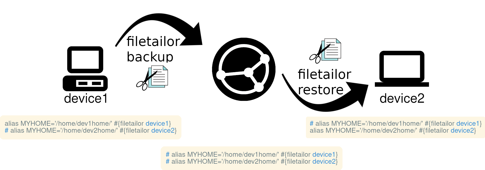

# filetailor

**Update:** I have since discovered [Chezmoi](https://www.chezmoi.io/), which has many of the same features as filetailor and is much more mature. I recommend using Chezmoi instead. However, Chezmoi does rely on templates, unlike filetailor.

filetailor is a peer-based configuration management utility for plain-text files (and directories) such as dotfiles. Files are backed up to a specified folder using filetailor, copied to another device using tools such as [Nextcloud](https://nextcloud.com/), [Syncthing](https://syncthing.net/), or [Git](https://git-scm.com/), and then copied to other devices using filetailor again. No symbolic links are used in the process.

During the backup and restore process, filetailor can modify the file contents and path for the specific device according to variables and line-specific controls defined in YAML _without_ the use of templates. See [list of features](https://github.com/k4j8/filetailor/wiki/Features).



<!-- START doctoc generated TOC please keep comment here to allow auto update -->
<!-- DON'T EDIT THIS SECTION, INSTEAD RE-RUN doctoc TO UPDATE -->
**Table of Contents**  *generated with [DocToc](https://github.com/thlorenz/doctoc)*

- [Example Usage](#example-usage)
- [Getting Started](#getting-started)
  - [Installation](#installation)
  - [Configuration](#configuration)
  - [Usage](#usage)
- [Line-Specific Control](#line-specific-control)
    - [Example: single-line control](#example-single-line-control)
- [Diff Programs](#diff-programs)
- [More Help](#more-help)
- [Contributing](#contributing)

<!-- END doctoc generated TOC please keep comment here to allow auto update -->

## Example Usage

Here's how to sync a file to use `dev1home` on "device1" and `dev2home` on "device2" for the alias `MYHOME`.

**.bashrc** on "device1":

```bash
alias MYHOME='/home/dev1home/' #{filetailor device1}
# alias MYHOME='/home/dev2home/' #{filetailor device2}
```
```bash
[user@device1 ~]$ filetailor add .bashrc
[user@device1 ~]$ filetailor backup
```

During backup from "device1" to the sync folder, the first line gets commented out because the tag matches the device name. Sync the sync folder with the backed-up version of the file using your preferred method of choice to "device2" then restore with filetailor. During restore on "device2", the second line gets uncommented (again, because the tag matches the device name).
```bash
[user@device2 ~]$ filetailor restore
```

**.bashrc** on "device2":

```bash
# alias MYHOME='/home/dev1home/' #{filetailor device1}
alias MYHOME='/home/dev2home/' #{filetailor device2}
```

## Getting Started

### Installation

filetailor requires Python 3.6+ and pip. Install by running the following commands:
```bash
$ pip install filetailor

$ filetailor init
# Update the newly created "filetailor.ini" with your desired locations for synced files and configuration YAML

$ filetailor init
# Accept confirmations to create directories
```

To sync filetailor between devices, sync the `sync_dir` and `yaml_dir` folders created in the above steps using Git, Syncthing, etc.

See [Alternative Installs](https://github.com/k4j8/filetailor/wiki/Alternative-Installs) for other installation methods.

### Configuration

`filetailor.yaml` ("the YAML") controls which files sync to which devices.

You can add/remove files to and from the YAML by running `filetailor add PATHS` and `filetailor remove PATHS` (local paths are okay). Alternatively, you can update the YAML manually by following the comments within.

The YAML also defines variables, which are strings to replace when restoring to a specific device, such as a path to a file that differs between devices. See the [FAQ](https://github.com/k4j8/filetailor/wiki/FAQ) in the wiki for examples.

### Usage

To backup all files defined in the YAML from the local device to the sync folder, run `filetailor backup`. Lines/blocks matching the device name will be commented out as they are copied to the sync folder.

To restore all files defined in the YAML from the sync folder to the local device, run `filetailor restore`. Lines/blocks matching the device name will be uncommented as they are copied to the local device.

To list all available commands, run `filetailor --help`. For command details, run `filetailor COMMAND --help`.

## Line-Specific Control

You can control the contents of individual files by device with line-specific controls such as the [Example Usage](https://github.com/k4j8/filetailor#example-usage) above. There are two types of line-specific controls: single-line and multi-line.

To use a single-line control, append a tag to the line you want to be commented out on other devices. During backup, any lines tagged for the current device will be commented out. During restore, lines tagged for the current device will be uncommented. Single-line control tag format:
<pre><code class="text">(Code being controlled) <i>COMMENT_SYM</i><b>{filetailor</b> <i>DEVICES</i>...<b>}</b></code></pre>
`COMMENT_SYM` is any symbol(s) used for comments and must be preceded by at least one space.

To control a block of lines, see [Multi-line Controls](https://github.com/k4j8/filetailor/wiki/Multi-Line-Controls).

#### Example: single-line control

How the code should be written on "desktop":
```bash
export $device_type="desktop" #{filetailor desktop}
# export $device_type="laptop" #{filetailor laptop1 laptop2}
```

After backing up the file through filetailor and then restoring to "laptop1" or "laptop2", the code would appear like this:
```bash
# export $device_type="desktop" #{filetailor desktop}
export $device_type="laptop" #{filetailor laptop1 laptop2}
```

How the code would look on any other device and in the filetailor sync folder:
```bash
# export $device_type="desktop" #{filetailor desktop}
# export $device_type="laptop" #{filetailor laptop1 laptop2}
```

## Diff Programs

Before backing up or restoring files, filetailor will show a diff of the changes. To set the diff programs for filetailor, add the following option to `filetailor.ini`.
```ini
[TOOLS]
diff_pager = YOUR_FAVORITE_DIFF_PROGRAM  # for viewing diff in terminal
difftool = YOUR_FAVORITE_DIFFTOOL  # for making edits during diff in external tool
```

If `diff_pager` is not set, filetailor will use `core.pager` (from Git config, [git-config docs](https://git-scm.com/docs/git-config)) if defined, otherwise uses `diff`.
If `difftool` is not set, filetailor will use `diff.tool` (from Git config, [git-difftool docs](https://git-scm.com/docs/git-difftool)) if defined, otherwise uses `diff`.

One popular supported diff pager is [Delta](https://github.com/dandavison/delta#installation). To install, follow the installation instructions in the link.

Run the following command to set Delta as your [default pager for Git](https://www.git-scm.com/book/en/v2/Customizing-Git-Git-Configuration) (and thus filetailor):
```bash
$ git config --global core.pager delta
```

## More Help

See [FAQ](https://github.com/k4j8/filetailor/wiki/FAQ) in the wiki for more help and examples.

Links:
- [GitHub](https://github.com/k4j8/filetailor)
- [PyPI](https://pypi.org/project/filetailor/)
- [AlternativeTo](https://alternativeto.net/software/filetailor/about/)

## Contributing

Feedback is welcome! Ways to contribute include:
- Report a bug
- Recommendations on new features
- Suggestions to improve documentation and print statement readability

Pull requests are welcome as well, but please open an issue first describing the change. When submitting PRs, please try to conform to the following style guides:
- Python code style: [PEP8](https://www.python.org/dev/peps/pep-0008/)
- Man page formatting: [man-pages(7)](https://man7.org/linux/man-pages/man7/man-pages.7.html)
- Commit message formatting: [How to Write a Git Commit Message](https://chris.beams.io/posts/git-commit/)
- Packaging: [Python Packaging User Guide](https://packaging.python.org/)
- Release versioning: [Semantic Versioning](https://semver.org/)
