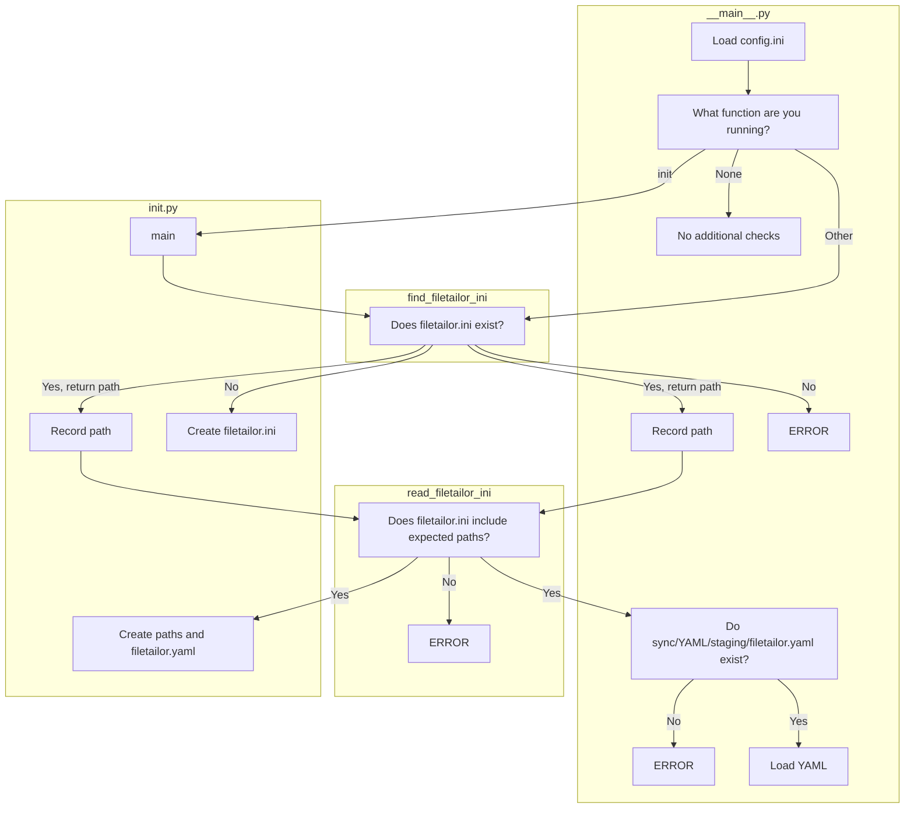

```mermaid
graph

linkStyle default interpolate basis

subgraph __main__.py
main1[Load config.ini]
main2[What function are you running?]
main3[No additional checks]
main4[Record path]
main5[ERROR]
main6[Do sync/YAML/staging/filetailor.yaml exist?]
main7[ERROR]
main8[Load YAML]
end

subgraph read_filetailor_ini
read1[Does filetailor.ini include expected paths?]
read2[ERROR]
end

subgraph init.py
init1[main]
init2[Record path]
init3[Create filetailor.ini]
init4[Create paths and filetailor.yaml]
end

subgraph find_filetailor_ini
find1[Does filetailor.ini exist?]
end

main1 --> main2
main2 -- None --> main3
main2 -- init --> init1

main2 -- Other --> find1
init1 --> find1
find1 -- No --> main5
find1 -- No --> init3
find1 -- Yes, return path --> main4
find1 -- Yes, return path --> init2

main4 --> read1
init2 --> read1
read1 -- No --> read2
read1 -- Yes --> main6
read1 -- Yes --> init4

main6 -- No --> main7
main6 -- Yes --> main8
```
