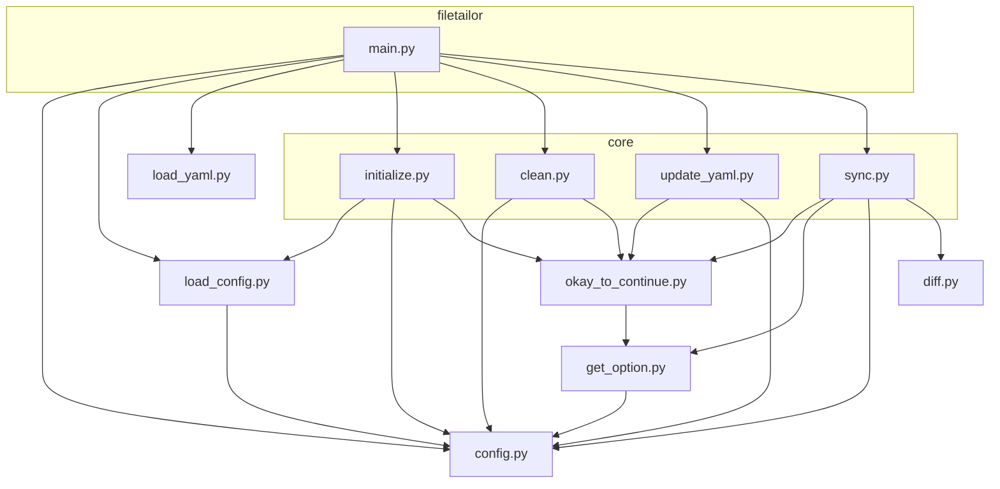

```mermaid
graph
subgraph filetailor
  main.py
end
subgraph core
  clean.py
  initialize.py
  sync.py
  update_yaml.py
end

main.py --> config.py

main.py --> load_config.py
main.py --> load_yaml.py

main.py --> initialize.py
main.py --> clean.py
main.py --> update_yaml.py
main.py --> sync.py

get_option.py --> config.py
load_config.py --> config.py
okay_to_continue.py --> get_option.py

clean.py --> config.py
clean.py --> okay_to_continue.py
initialize.py --> load_config.py
initialize.py --> config.py
initialize.py --> okay_to_continue.py
sync.py --> okay_to_continue.py
sync.py --> get_option.py
sync.py --> config.py
sync.py --> diff.py
update_yaml.py --> okay_to_continue.py
update_yaml.py --> config.py
```
