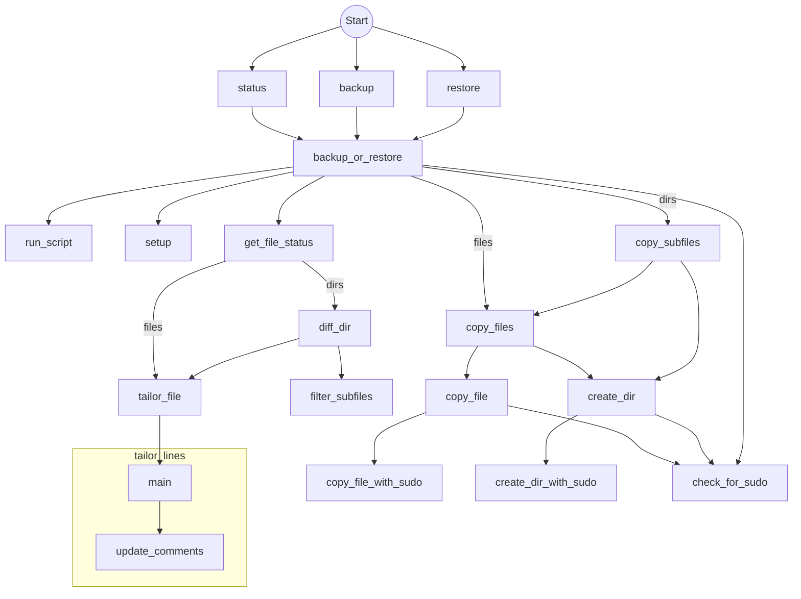

```mermaid
graph
linkStyle default interpolate basis

subgraph tailor_lines
main
update_comments
end

%% Specify order of certain files to avoid overlapping arrows
1((Start))
tailor_file
filter_subfiles
copy_file

1 --> status
1 --> backup
1 --> restore

status --> backup_or_restore
backup --> backup_or_restore
restore --> backup_or_restore

backup_or_restore --> run_script

backup_or_restore --> setup

backup_or_restore --> get_file_status

get_file_status -- dirs --> diff_dir

diff_dir --> filter_subfiles

get_file_status -- files --> tailor_file
diff_dir --> tailor_file

backup_or_restore -- dirs --> copy_subfiles

backup_or_restore -- files --> copy_files
copy_subfiles --> copy_files

copy_files --> copy_file
copy_file --> copy_file_with_sudo

copy_files --> create_dir
copy_subfiles --> create_dir
create_dir --> create_dir_with_sudo

copy_file --> check_for_sudo
create_dir --> check_for_sudo
backup_or_restore --> check_for_sudo

tailor_file --> main
main --> update_comments
```
