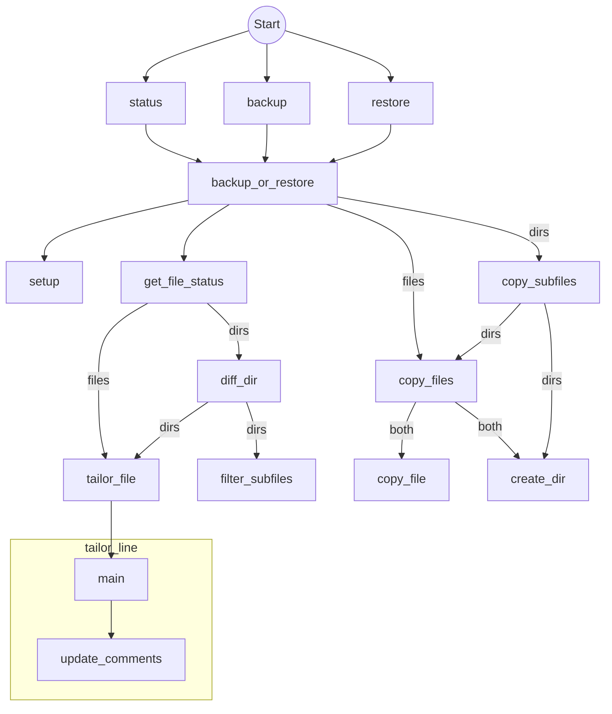

```mermaid
graph
linkStyle default interpolate basis

subgraph tailor_line
main
update_comments
end

%% Specify order of certain files to avoid overlapping arrows
1((Start))
tailor_file
filter_subfiles
copy_file

1 --> status
1 --> backup
1 --> restore

status --> backup_or_restore
backup --> backup_or_restore
restore --> backup_or_restore

backup_or_restore --> setup

backup_or_restore --> get_file_status

get_file_status -- dirs --> diff_dir

diff_dir -- dirs --> filter_subfiles

get_file_status -- files --> tailor_file
diff_dir -- dirs --> tailor_file

backup_or_restore -- dirs --> copy_subfiles

backup_or_restore -- files --> copy_files
copy_subfiles -- dirs --> copy_files

copy_files -- both --> create_dir
copy_subfiles -- dirs --> create_dir

copy_files -- both --> copy_file

tailor_file --> main
main --> update_comments
```
